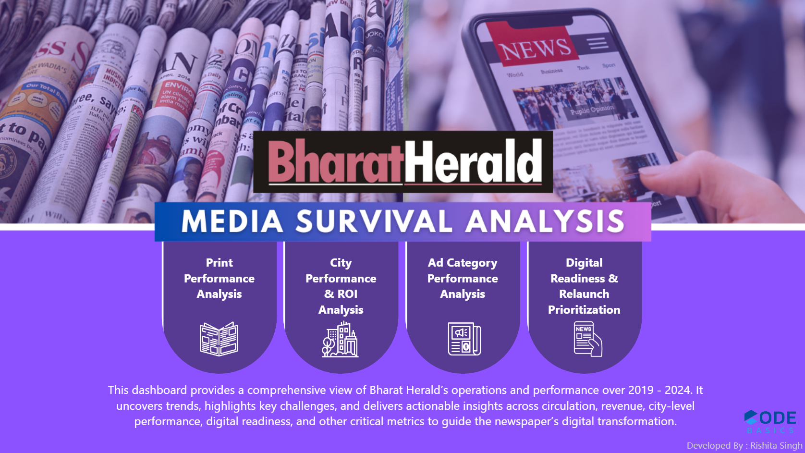
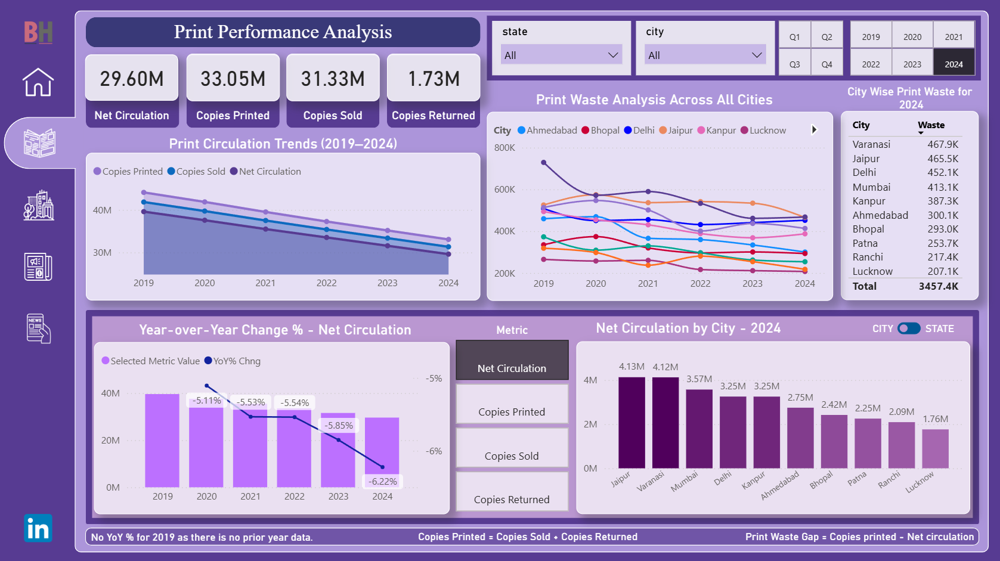
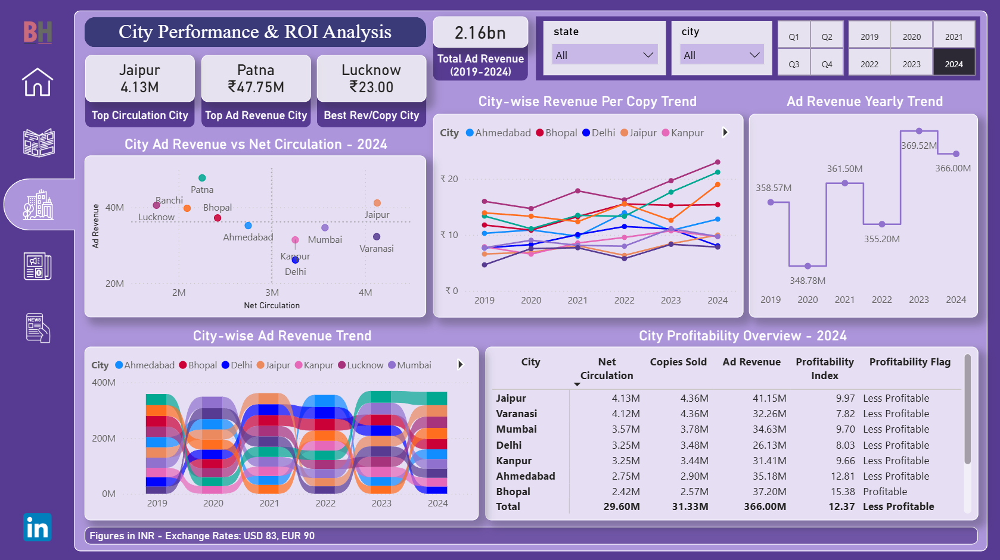
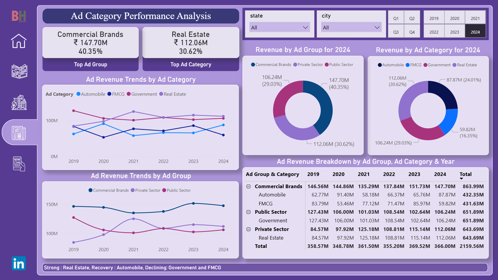
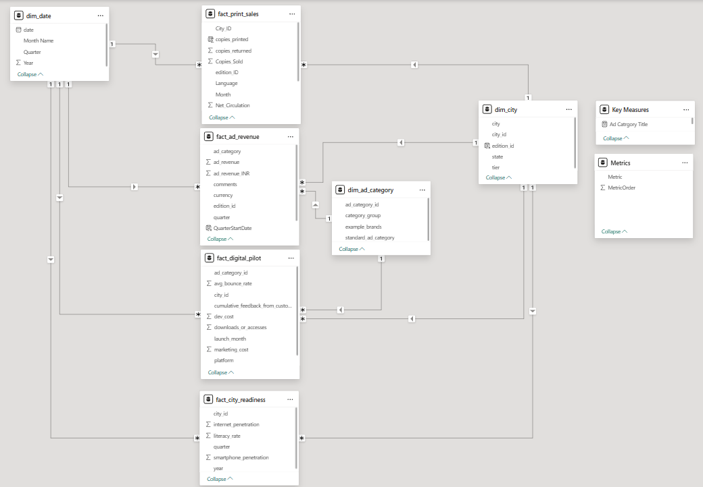

# Bharat-Herald---Media-Survival-Analysis-RPC17
This repository contains my submission for the **Codebasics Resume Project Challenge 17**.   It explores the decline of Bharat Herald, a 70+ year-old Indian newspaper, and provides data-driven insights and recommendations for its digital transition.  
---

## 🔗 Live Dashboard

**📊 [View Live Dashboard](https://app.powerbi.com/view?r=eyJrIjoiZDIxZWVjYjYtYmM4MC00NjFjLTgwZTYtZDNjZTgzNDA0MzhlIiwidCI6ImM2ZTU0OWIzLTVmNDUtNDAzMi1hYWU5LWQ0MjQ0ZGM1YjJjNCJ9)**

## 📖 Project Context  

Bharat Herald once printed over **1 million copies daily**, but by 2024 this had fallen to nearly half.  
Key challenges included:  
- Pandemic-driven acceleration of digital news consumption  
- Failed digital pilot in 2021 due to poor usability  
- Declining advertiser confidence  
- Bureau closures and layoffs  

Competitors such as **DigiHindi Post, NewsZilla, and InShorts** adapted faster with mobile-first strategies, leaving Bharat Herald behind.  

---

## 🎯 Business Problem  

The management wanted to understand:  
1. **Why circulation and ad revenues are declining**  
2. **Which cities and categories still have profitability potential**  
3. **How to strategically relaunch digital initiatives**  

---

## 🗂️ Approach  

The analysis was structured into **three levels**:  

- **Primary Analysis** → Circulation, ad revenue, and digital adoption trends  
- **Strategy & Recommendations** → Supporting context and strategy recommendations  
- **Ad-hoc Requests** → Specific explorations for sharper decision-making  

---

## 📊 Key Insights  

### 📰 Circulation  
- Copies printed dropped from **44.1M in 2019 → 33.1M in 2024** (consistent 5–6% decline per year).  
- Top circulation cities (Jaipur, Varanasi, Mumbai, Delhi, Kanpur) together make up **60% of volume** but are **less profitable**.  
- Smaller cities like **Lucknow, Patna, Ranchi** show **higher profitability indices** (above 19).  

### 📉 Print Waste  
- Annual waste fell from **4.5M (2019) → 3.5M (2024)**, a **22% reduction**.  
- However, Delhi shows no improvement, wasting ~450k copies every year.  

### 💰 Advertising  
- **Real Estate (+33%)** and **Automobile (+40%)** recovered strongly.  
- **FMCG (–29%)** and **Government Ads (–17%)** declined steadily.  
- Patna, Jaipur, and Lucknow together contribute **~35% of total ad revenue**.  
- Circulation ≠ Revenue → Patna and Lucknow outperform despite smaller circulation bases.  

### 📱 Digital Readiness vs Engagement  
- **High readiness, low engagement cities:** Kanpur, Bhopal, Patna, Ranchi.  
- These are **priority markets** for digital re-launch.  

### ⚖️ Revenue Efficiency  
- **Lucknow (₹23/copy), Patna (₹21.2/copy), Ranchi (₹19/copy)** lead in monetization efficiency.  
- Larger cities like Delhi and Varanasi underperform despite scale.  

---

## 🚀 Recommendations  

1. **Phased Digital Transition**  
   - Phase 1 → Kanpur, Varanasi, Bhopal (high readiness + urgency).  
   - Phase 2 → Medium readiness but high engagement cities.  
   - Phase 3 → Lower readiness markets (focus on awareness).  

2. **Ad Revenue Revival**  
   - FMCG → Client re-engagement, case studies, competitive packages.  
   - Government → Local partnerships, transparent performance reporting.  

3. **Boosting Engagement**  
   - WhatsApp bulletins & alerts  
   - Mobile-first e-papers with offline mode  
   - Interactive polls, community forums, and video integration  

4. **Monetization Models**  
   - Print + Digital bundles (family plans)  
   - Loyalty rewards with local businesses  
   - Pay-per-article and micro-subscriptions  

5. **Regional Trust Building**  
   - Collaborations with local journalists and influencers  
   - City-specific digital editions  
   - Community events & town halls  

---

## 📌 Ad-hoc Analysis Highlights  

- **Top circulation drops**: Varanasi (Jan 2021, Nov 2019), Jaipur (Jan 2020).  
- **No ad category >50% revenue** → diversification reduces risk.  
- **Top print efficiency (2024):** Ranchi, Ahmedabad, Patna, Jaipur, Varanasi (~90%).  
- **Internet readiness growth (2021):** Kanpur (+2.5%), Mumbai (+2.43%), Ranchi (–3.13%).  
- **No city with continuous decline in both circulation + revenue** (positive resilience).  

---

## 🛠️ Tools & Tech  

- **Power BI** → Dashboard creation and storytelling  
- **Power Query** → Data cleaning, shaping, and transformation  
- **SQL** → Querying ad-hoc requests and deeper analysis   
- **DAX** → Calculated measures and KPIs within Power BI  

---

## 📊 Dashboard Preview  

### 🏠 Home Page  

### 📰 Print Performance & Analysis  

### 🌆 City Performance & ROI Analysis  

### 📂 Ad Category Performance Analysis  

### 💻 Digital Readiness & Relaunch Prioritization  

### 🗂️ Data Model  

---

**Rishita Singh**  
Linkedin : https://www.linkedin.com/in/rishitasingh27/

